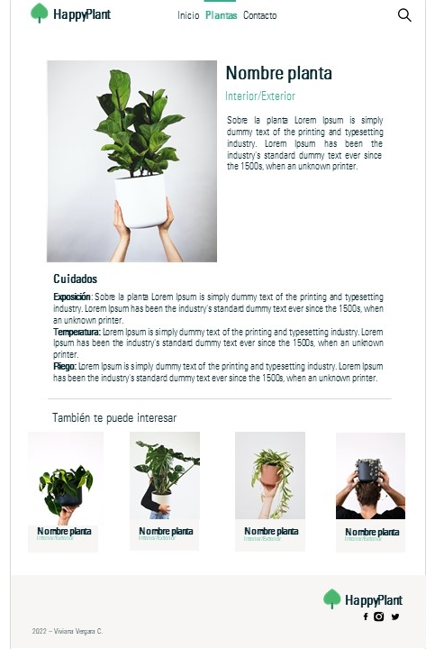

## Content
It is a project created to practice developing in React JS.

## Demo
Not today...

## Getting started
* Move into you project directory
* Clone this repository
* Move into the project directory
* You must have npm installed: `npm install`
* Run the development task: `npm start`

Starts the project at http://localhost:3000/
Automatically restarts when any of your files change.

## Mockups

**Note: Mockups may look different than the final project**

##Credit
All photographs are from [@feeypflanzen](https://unsplash.com/@feeypflanzen).

